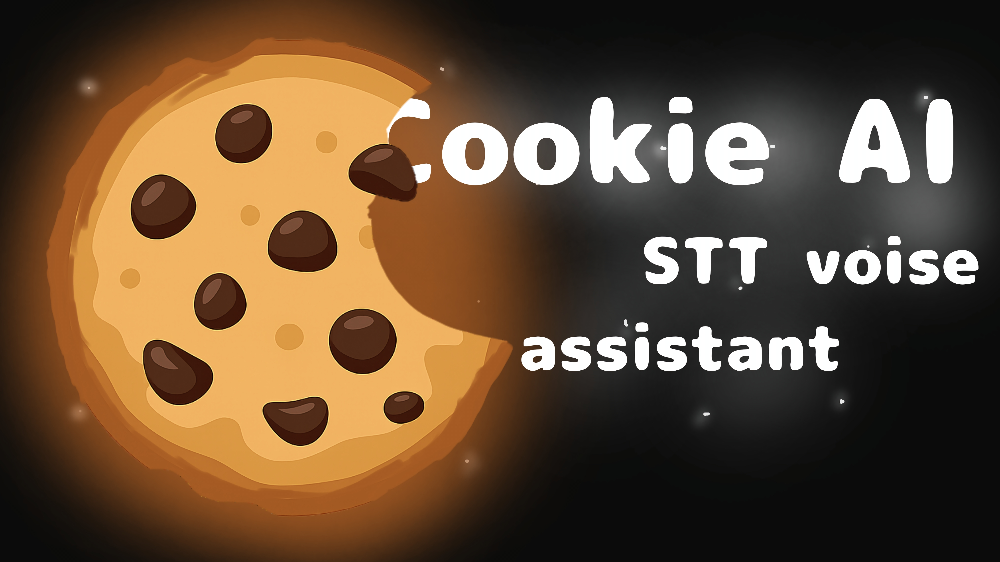

# Cookie Voice Assistant 🍪

**Cookie** — оффлайн-первый голосовой ассистент для Windows с обучением wake-word, распознаванием речи и выполнением команд.



---

## 🌟 Основные возможности

- **🎙️ Персональное обучение wake-word**: Научите ассистента распознавать именно ваш голос
- **🔊 Offline STT**: Полностью оффлайн распознавание речи через Vosk
- **🎯 Два wake-word движка**: Rustpotter (рекомендуется) и Vosk
- **⚙️ YAML команды**: Простое создание пользовательских команд
- **🖥️ Системный трей**: Работа в фоне
- **📊 Современный UI**: Svelte + Tauri + SvelteUI
- **🔐 100% Offline**: Все работает без интернета после установки

---

## 🛠️ Системные требования

### Для запуска:
- **ОС**: Windows 10/11 (64-bit)
- **RAM**: 4 ГБ (рекомендуется 8 ГБ)
- **Диск**: 500 МБ свободного места
- **Микрофон**: Любой USB/встроенный микрофон

### Для сборки:
- **Rust**: 1.70+
- **MSVC Build Tools**: Visual Studio 2019+
- **Node.js**: 16+
- **Интернет**: Для загрузки моделей и зависимостей

---

## 🚀 Быстрый старт

### Вариант 1: Автоматическая сборка (рекомендуется)

#### PowerShell (рекомендуется)
```powershell
.\build.ps1
```

**Что делает скрипт:**
- ✅ Проверяет Rust, MSVC, Node.js
- ✅ Автоматически загружает модель Vosk (~35MB)
- ✅ Создаёт необходимые директории
- ✅ Запускает `cargo check`
- ✅ Компилирует backend (Rust)
- ✅ Собирает frontend (Svelte/Vite)
- ✅ Создаёт финальный .exe
- ✅ Показывает красивые логи с прогрессом

#### Batch (альтернатива)
```batch
build.bat
```

Более простая версия без автозагрузки моделей.

---

## 📖 Первый запуск и обучение

### 1. Запустите Cookie.exe

После сборки запустите приложение. При первом запуске откроется экран обучения.

### 2. Обучение wake-word

Cookie попросит вас пройти обучение для персонализации:

1. **Нажмите "Записать образец 1"**
2. **Произнесите четко: "Cookie"**
3. **Повторите для образцов 2 и 3**
4. **Нажмите "Обучить модель"**

**💡 Советы для лучшего распознавания:**
- Говорите четко и громко
- Используйте одну и ту же интонацию
- Избегайте фонового шума
- Держите одинаковое расстояние от микрофона

### 3. Пропуск обучения

Можете нажать **"Пропустить"** — будет использована дефолтная модель, но распознавание будет менее точным.

---

## 🎯 Использование

### Активация ассистента

1. Произнесите: **"Cookie"**
2. Дождитесь звукового сигнала
3. Произнесите команду, например:
   - "Открой браузер"
   - "Какое время"
   - "Закрой окно"

### Создание своих команд

Команды хранятся в `%APPDATA%/com.priler.cookie/commands/`

**Пример команды** (`open_browser.yaml`):
```yaml
name: "открой браузер"
keywords:
  - "открой браузер"
  - "запусти браузер"
  - "включи интернет"
actions:
  - type: "process"
    path: "C:\\Program Files\\Google\\Chrome\\Application\\chrome.exe"
  - type: "sound"
    file: "success.wav"
```

**Типы действий:**
- `process` — запуск программы
- `sound` — воспроизведение звука
- `terminate` — завершение работы
- `chain` — выполнение следующей команды

---

## ⚙️ Настройки

### Wake-word движки

#### 1. **Rustpotter** (по умолчанию, рекомендуется)
- ✅ Полностью offline
- ✅ Быстрый и точный
- ✅ Обучаемый под ваш голос
- ✅ Не требует API ключей
- ✅ Минимальное потребление ресурсов

#### 2. **Vosk**
- ✅ Полностью offline
- ✅ Универсальный
- ✅ Работает "из коробки"
- ⚠️ Менее точный для wake-word

### Переключение движка

В интерфейсе: **Настройки → Wake-word engine → Выбрать Rustpotter/Vosk**

### Выбор микрофона

**Настройки → Микрофон → Выбрать устройство**

---

## 🐛 Решение проблем

### Cookie не запускается

**Решение:**
1. Установите [Microsoft Visual C++ Redistributable](https://aka.ms/vs/17/release/vc_redist.x64.exe)
2. Проверьте что микрофон доступен в системе
3. Запустите от имени администратора

### Ассистент не слышит команды

**Возможные причины:**

1. **Микрофон не работает**
   - Проверьте настройки в Windows
   - Проверьте громкость микрофона
   
2. **Wake-word не распознается**
   - Переобучите модель (Настройки → Переобучить)
   - Говорите четче и громче
   - Попробуйте другой движок (Vosk)

3. **STT не работает**
   - Проверьте что модель Vosk установлена
   - Путь: `%APPDATA%/com.priler.cookie/models/vosk-model-small-ru-0.22`

### Модели не найдены

**Решение:**
1. Запустите `build.ps1` снова (автозагрузка)
2. Или скачайте вручную:
   - [Vosk Model (RU)](https://alphacephei.com/vosk/models/vosk-model-small-ru-0.22.zip)
   - Распакуйте в `gui/src-tauri/models/`

### Ошибки компиляции

#### "Rust not found"
```bash
# Установите с https://rustup.rs/
curl --proto '=https' --tlsv1.2 -sSf https://sh.rustup.rs | sh
```

#### "MSVC not found"
1. Скачайте [Visual Studio Build Tools](https://visualstudio.microsoft.com/downloads/)
2. Установите компонент: **"Desktop development with C++"**

#### "Link errors"
```bash
rustup default stable-msvc
```

---

## 📁 Структура проекта

```
cookie/
├── app/                          # Standalone Rust приложение
│   ├── src/                     # Исходники
│   ├── commands/                # Команды по умолчанию
│   └── models/                  # ML модели
├── gui/                         # Tauri GUI приложение
│   ├── src/                     # Svelte фронтенд
│   │   ├── pages/              # Страницы (index, settings, onboarding)
│   │   └── components/         # UI компоненты
│   ├── src-tauri/              # Rust backend
│   │   ├── src/                # Tauri исходники
│   │   │   ├── tauri_commands/ # Команды API
│   │   │   ├── config.rs       # Конфигурация
│   │   │   ├── db.rs           # База данных (JSON)
│   │   │   └── main.rs         # Entry point
│   │   ├── models/             # Vosk модели
│   │   └── rustpotter/         # Rustpotter модели
│   └── public/                 # Статические ресурсы
├── build.bat                   # Build скрипт (Batch)
├── build.ps1                   # Build скрипт (PowerShell)
└── README.md                   # Этот файл
```

---

## 🔧 Для разработчиков

### Запуск в dev режиме

```bash
cd gui
npm install
npm run tauri dev
```

### Проверка кода

```bash
# Backend (Rust)
cd gui/src-tauri
cargo check
cargo clippy
cargo fmt

# Frontend (Svelte)
cd gui
npm run check
```

### Production сборка

```bash
cd gui
npm run tauri build
```

### Логи

**Путь к логам:**
```
%APPDATA%/com.priler.cookie/log.txt
```

**Просмотр в реальном времени:**
```bash
Get-Content "$env:APPDATA/com.priler.cookie/log.txt" -Wait
```

---

## 🗂️ Конфигурация

### Файл настроек

**Путь:** `%APPDATA%/com.priler.cookie/app.db`

**Формат:** JSON

**Пример:**
```json
{
  "microphone": 0,
  "voice": "",
  "wake_word_engine": "Rustpotter",
  "speech_to_text_engine": "Vosk",
  "onboarding_completed": true
}
```

### Переменные окружения

```bash
# Путь к моделям (опционально)
COOKIE_MODELS_PATH=C:\path\to\models

# Уровень логирования
COOKIE_LOG_LEVEL=debug
```

---

## 🤝 Вклад в проект

Приветствуем любой вклад!

### Процесс

1. **Fork** репозитория
2. Создайте **feature branch**: `git checkout -b feature/AmazingFeature`
3. **Commit** изменения: `git commit -m 'Add AmazingFeature'`
4. **Push** в branch: `git push origin feature/AmazingFeature`
5. Откройте **Pull Request**

### Гайдлайны

- Используйте осмысленные commit сообщения
- Добавляйте тесты для новой функциональности
- Обновляйте документацию
- Следуйте style guide (rustfmt, prettier)

---

## 📝 Лицензия

Распространяется под лицензией **GPL-3.0**.

Подробности в [LICENSE.txt](LICENSE.txt)

---

## 👥 Авторы

- **Abraham Tugalov** — Оригинальный автор Jarvis
- **Cookie Contributors** — Форк и улучшения

---

## 🔗 Полезные ссылки

- [Telegram канал](https://t.me/cookie_assistant)
- [Обратная связь](https://t.me/cookie_feedback_bot)
- [Issues на GitHub](https://github.com/yourusername/cookie/issues)
- [Документация Tauri](https://tauri.app)
- [Rustpotter GitHub](https://github.com/GiviMAD/rustpotter)
- [Vosk официальный сайт](https://alphacephei.com/vosk/)
- [Vosk модели](https://alphacephei.com/vosk/models)

---

## 🙏 Благодарности

- **Tauri** — за отличный фреймворк для desktop приложений
- **Rustpotter** — за мощный wake-word detection
- **Vosk** — за качественный offline STT
- **Svelte** — за реактивный и быстрый UI фреймворк
- **Сообществу** — за поддержку и фидбек!

---

## 🎓 FAQ

### В: Можно ли использовать на других языках?
**О:** Да! Скачайте соответствующую [модель Vosk](https://alphacephei.com/vosk/models) и замените в `models/`.

### В: Сколько занимает места?
**О:** ~200 МБ (приложение + модели)

### В: Работает ли без интернета?
**О:** Да! Полностью offline после установки.

### В: Можно ли использовать свои wake-words?
**О:** Пока только "Cookie". Кастомные wake-words в планах.

### В: Поддержка Linux/macOS?
**О:** В планах. Пока только Windows.

### В: Можно ли интегрировать с другими приложениями?
**О:** Да! Через команды `process` запускайте что угодно.

---

## 📊 Производительность

| Параметр | Значение |
|----------|----------|
| Потребление RAM | ~150-200 MB |
| CPU (idle) | <1% |
| CPU (listening) | 5-10% |
| Wake-word latency | <200ms |
| STT latency | 1-3s |

---

## 🛣️ Roadmap

- [ ] Кастомные wake-words
- [ ] Поддержка Linux/macOS
- [ ] Плагин система
- [ ] Онлайн режим (Gemini API)
- [ ] TTS (Text-to-Speech)
- [ ] Мультиязычность
- [ ] Docker контейнер
- [ ] REST API
- [ ] Mobile app

---

**Сделано с ❤️ и 🍪**

*Cookie Voice Assistant — ваш персональный оффлайн помощник*
